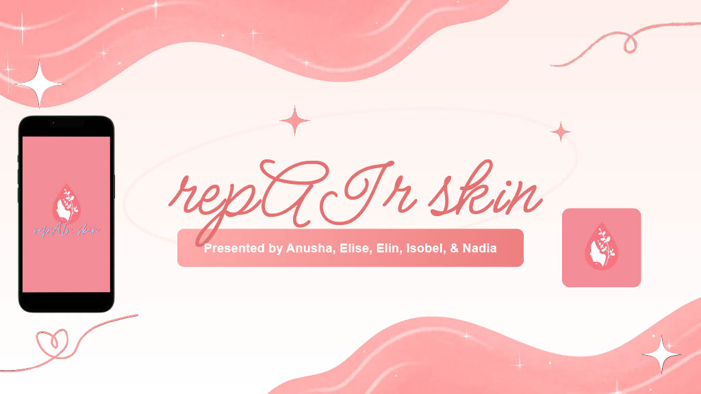
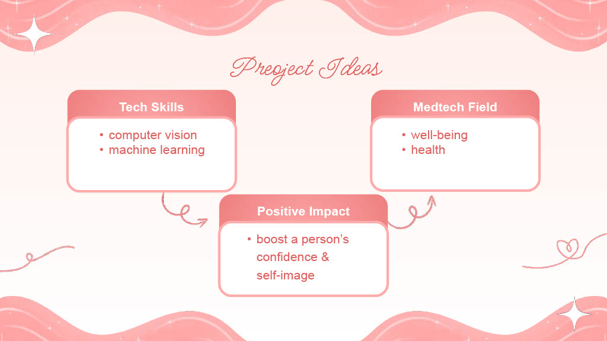
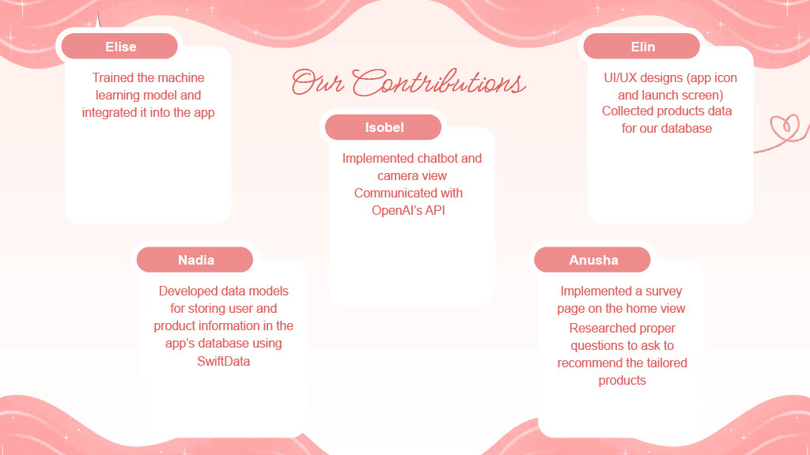
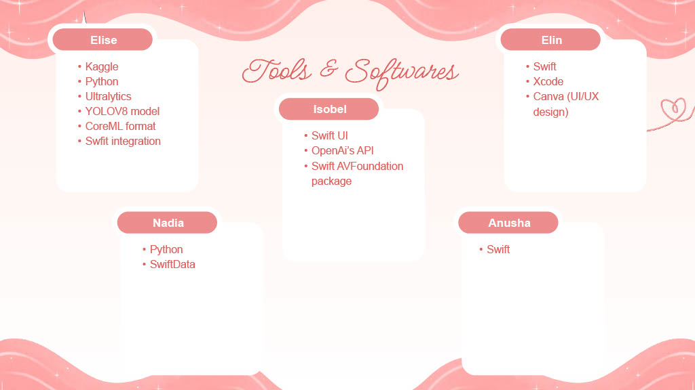
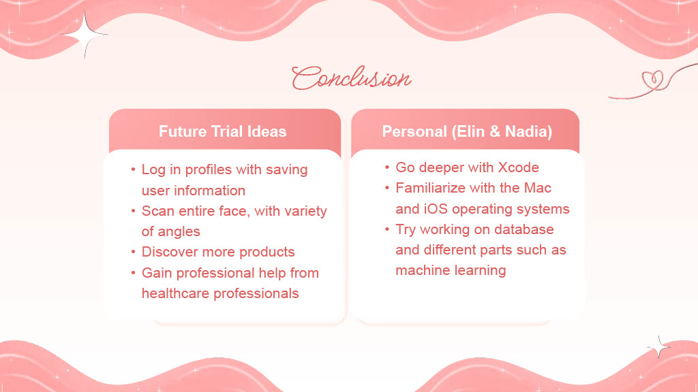

repAIr Skin is an iOS app that utilizes machine learning and computer vision technologies to offer personalized skincare solutions. The app detects skin types and acne through real-time facial scans and recommends suitable skincare products based on the analysis.

- Developed using SwiftUI, integrated with YOLOV8 model for skin analysis.
- Utilizes OpenAI's API for chatbot functionality, creating a seamless user experience.
- Features a survey for user preferences, with a backend database storing user data to recommend products that suit individual skin types.
 
This project combines technology and healthcare to create an innovative tool that enhances self-care through personalized recommendations based on real-time skin analysis.
 
 

  

  

  

  

  

  

  

  

  

  

  

  

  

  

  

  

